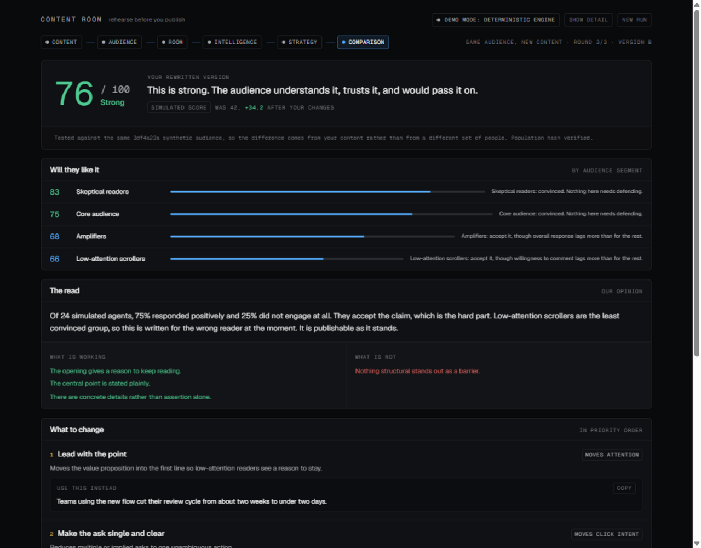
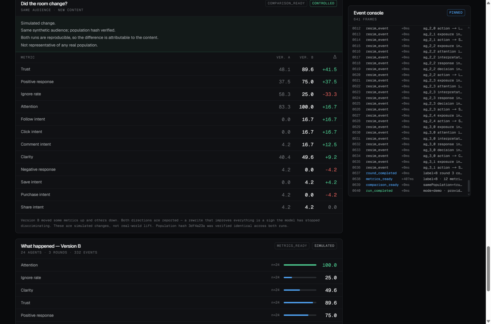
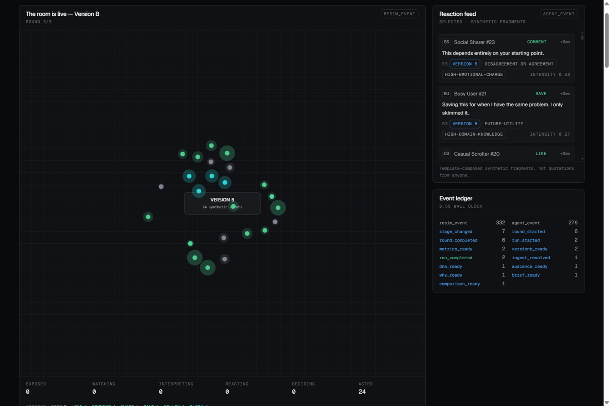

<div align="center">

# Content Room

**Rehearse before you publish.**

Put any piece of content in front of a simulated audience and find out how it lands —<br>
before the real one sees it.

[**Open the live demo →**](https://content-room-dun.vercel.app)

[](https://nextjs.org)
[](https://react.dev)
[](https://www.typescriptlang.org)
[](#testing)
[](https://content-room-dun.vercel.app)

</div>

---

> **Status.** Working end to end and deployed. The live model tier is verified in production: a full run is served by Groq across all four analysis tasks (`degraded=false`), in about 11 seconds. It also runs with **no API keys at all** — see [below](#it-works-with-no-api-keys-at-all).

---

## What it does

Paste a post, an ad, an email, a script, or a link. Content Room builds a synthetic audience from the content itself, runs them through the journey a real reader takes, and tells you what happened.

You get one screen with five answers:

- **Is it good?** — a score out of 100 and a band: Weak / Mixed / Solid / Strong
- **Will they like it?** — how each audience segment reacts, and which metric that segment loses it on
- **What do you think?** — two or three sentences of plain opinion
- **What do I change?** — three concrete changes, each with the rewritten text ready to copy
- **Will it spread?** — Low / Moderate / High amplification potential

Then you click **Test it**, and the *same* simulated audience reacts to the rewritten version so you can see whether the room actually changed.

<p align="center">
  
</p>

## The part that matters: a controlled re-test

Anyone can generate a rewrite. The question a rehearsal has to answer is whether the rewrite is actually better — and answering that properly means holding the audience constant.

So the audience is a **fixed population**, derived from a seed. Version A and Version B run against the same agents, and the code **asserts** the population hash matches rather than trusting it. If the hash differs, the comparison is refused instead of being presented as controlled:

```ts
assertSamePopulation(audience.ref, recheck);   // throws AudienceMismatchError on mismatch
```

Every comparison carries a mandatory caveat, and which one depends on provenance:

| Situation | What the user is told |
|---|---|
| Same population, reproducible engine | *"Simulated change. Same synthetic audience; population hash verified. Both runs are reproducible, so the difference is attributable to the content."* |
| Same population, sampled reactions | *"Audience held constant. Reactions resampled."* |
| Audience regenerated | *"WARNING: the audience was regenerated, so this is NOT a controlled comparison."* |

<p align="center">
  
</p>

## Inside the room

Every agent moves through the same six stages a real reader does — exposure → attention → interpretation → response → decision → action — and what they do is one of `STOP` `IGNORE` `LIKE` `COMMENT` `SHARE` `SAVE` `FOLLOW` `CLICK` `BUY` `REJECT`.

The room encodes exactly three things and nothing else: **fill** is stage (valence once they have acted), **halo** is reaction intensity, **proximity** is segment grouping.

<p align="center">
  
</p>

## It works with no API keys at all

This is not a fallback. It is the default architecture.

The simulation engine is deterministic and ours: no model calls, no network, no clock, no `Math.random()`. Every sampled value is derived from `(seed, agentId, round)`, which makes runs **order-independent and byte-identical across replays**.

Model providers are a tier on top:

```
Gemini  →  Groq  →  deterministic heuristic
```

The final tier is not a model. It is a real analyser that reads the actual text, and because every AI task must supply a deterministic answer, *a request that could leave the user with nothing cannot be constructed in the first place*:

```ts
type StructuredRequest<T> = {
  task: AiTaskId;
  schema: ZodType<T>;
  instructions: string;
  prompt: string;
  deterministic: () => T;   // REQUIRED — the chain can always terminate
};
```

The result: it runs offline, on a plane, with zero configuration, and with every number labelled as simulated.

## Honesty is enforced by types, not discipline

The promises this product makes are properties of the schema, so a future change cannot quietly drop one:

| Promise | Enforced by |
|---|---|
| No number without a sample size | `Metric.n` is required |
| No number claims to be real-world data | `Metric.kind` is the literal `'simulated_estimate'` |
| No comparison without a caveat | `Comparison.caveats` has `min(1)` |
| No explanation without evidence | `WhyReport.biggestSignal.evidence` has `min(1)` |
| No unvalidated accuracy claim | `ValidationStatus` reports `'not_established'`, and the calibrated branch requires `n` and a named method |

There is no benchmark. Nothing here has ever been compared against a real-world outcome, so the app says so on every screen rather than inventing a number.

**This is a rehearsal environment, not a prediction engine.** It is very good at telling you which of two versions of your own content a given audience prefers. It is not evidence about the real world.

## Architecture

```
                        ┌──────────────────────────────┐
   URL / pasted text ──►│  INGEST (SSRF-guarded)       │
                        │  metadata → article → paste  │
                        └──────────────┬───────────────┘
                                       ▼  ContentAsset
                        ┌──────────────────────────────┐
                        │  CONTENT DNA      (AI)       │
                        └──────────────┬───────────────┘
                                       ▼
                        ┌──────────────────────────────┐
                        │  CONTEXTUAL AUDIENCE         │
                        │  AI proposes segments,       │
                        │  seeded code builds agents   │
                        └──────────────┬───────────────┘
                                       ▼  AudienceRef{populationHash}
                        ┌──────────────────────────────┐
                        │  SIMULATION ENGINE (streams) │
                        │  deterministic │ oasis†      │
                        └──────────────┬───────────────┘
                                       ▼  AgentEvent[]
                        ┌──────────────────────────────┐
                        │  ANALYTICS   (pure, no AI)   │
                        └──────────────┬───────────────┘
                          ┌────────────┴────────────┐
                          ▼                         ▼
                   WHY (AI, grounded)        VALIDATION
                          │                   (not established)
                          ▼
                  CREATIVE DIRECTOR → VERSION B
                          ▼
              SAME AUDIENCE → RE-SIMULATE → COMPARISON

† OASIS is a deferred post-MVP adapter — see docs/architecture.md §9
```

**The rule that holds it together:** AI handles language; deterministic code handles every number. Validation, aggregation, percentages, comparisons, IDs, state transitions and business rules are pure functions with tests. No metric in this product originates from a language model.

### The interface is event-sourced

One append-only `RunEventLog` is the only source of truth. One **pure** reducer derives all display state. Every panel is a projection of it, which means a result **cannot appear before its cause** — the station rail unlocks from events, not from a step counter. The console beside the room shows every frame as it arrives, with the gap since the previous one.

600-event runs are batched into animation frames rather than rendered per event, so the room animates smoothly. The raw event console, the per-type ledger and the reaction feed are part of the product — a simulation you cannot inspect is not persuasive. Details in [`docs/event-driven-ui.md`](docs/event-driven-ui.md).

## Quick start

```bash
npm install
cp .env.example .env.local     # every key is optional
npm run dev
```

Open http://localhost:3000 and either paste something or press **Review it** with the box empty to load the worked example.

### Commands

```bash
npm run dev         # local dev
npm run build       # production build
npm run typecheck   # tsc --noEmit
npm run test        # 133 deterministic + contract + security tests
npm run demo        # headless full run with stage timings
npm run preflight   # everything a demo needs checked, before you present
npx tsx scripts/probe-model.ts   # inspect the reaction model's inputs
```

## API keys

**You need none.** One key upgrades the *wording* of the analysis; the score, the segments, the simulation and the comparison come from our own code either way.

| Provider | Key | Status |
|---|---|---|
| **Groq** | `GROQ_API_KEY` | **Verified in production** — a full run served across all four tasks |
| Google Gemini | `GOOGLE_GENERATIVE_AI_API_KEY` | Supported; the key used during development had depleted credits → 402 |
| OpenRouter | `OPENROUTER_API_KEY` | Any OpenAI-compatible endpoint also works |

### Four things that took calling the API to discover

Every one of these fails *silently* — the chain degrades to the deterministic tier and the run looks like it succeeded, so the badge is the only clue.

1. **Model ids drift.** `gemini-2.5-flash` authenticates and still appears in the models list, but returns 404 on `generateContent` ("no longer available to new users"). `llama-3.3-70b-versatile` is not in the current Groq model list at all. Both defaults were wrong.

2. **Providers demand different schema strictness.** Groq runs structured output in strict mode, which requires *every* property to be listed in `required`. One optional field made every request 400.

3. **Provider-wide and request-level failures are different things.** A `400` from one incompatible schema was initially treated as provider-wide, which removed a perfectly working provider for the entire run. Now `401/402/403` quarantine the provider; `400/404/422` skip only that request. A *generation* failure ("model produced malformed JSON") is stochastic and therefore retried — a schema *definition* failure is not.

4. **A valid key can still fail on billing.** Google keys authenticate fine and return `402 "prepayment credits are depleted"` when the project has billing enabled with exhausted credits — such a project does **not** fall back to the free tier.

Also worth knowing: Groq's free tier applies an **org-level** tokens-per-minute limit shared across all models, so spreading tasks across different models does *not* help. Keeping per-call input budgets modest does.

Full detail in [`docs/api-keys.md`](docs/api-keys.md).

## Documentation

| Document | Contents |
|---|---|
| [`docs/verdict.md`](docs/verdict.md) | How the score, the opinion, the changes and the viral read are computed |
| [`docs/event-driven-ui.md`](docs/event-driven-ui.md) | The event log, the reducer, and why a panel cannot precede its cause |
| [`docs/architecture.md`](docs/architecture.md) | Layers, data flow, determinism contract, security boundaries |
| [`docs/api-contracts.md`](docs/api-contracts.md) | **Frozen Zod contracts** — the interface everything else builds against |
| [`docs/simulation.md`](docs/simulation.md) | The reaction model, and an honest list of its limitations |
| [`docs/validation.md`](docs/validation.md) | Correctness vs predictive validity; what we can and cannot claim |
| [`docs/research.md`](docs/research.md) | Open-source research, with a source for every claim |
| [`docs/open-source.md`](docs/open-source.md) | Reuse decisions and the license risk register |
| [`docs/api-keys.md`](docs/api-keys.md) | Which keys are needed, and what breaks without them |
| [`docs/product.md`](docs/product.md) | What this is, who it is for, what it refuses to be |
| [`docs/ui-ux.md`](docs/ui-ux.md) | Design tokens, the room specification, the copy guide |
| [`docs/deployment.md`](docs/deployment.md) | Vercel constraints and the deploy checklist |
| [`docs/demo.md`](docs/demo.md) | The 90-second script and the failure matrix |
| [`AGENTS.md`](AGENTS.md) | Operating contract for contributors |

## Testing

**133 tests**, deterministic and offline — no live network calls, no model calls in the suite.

```bash
npm run test
```

What they actually protect:

- **Determinism** — byte-identical output across runs; order-independence proven, not assumed
- **The same-audience guarantee** — identical `populationHash` for a given seed, and a thrown `AudienceMismatchError` when it differs
- **Model sensitivity** — deliberately weak content must score *below* deliberately strong content, and a run where every agent approves **fails**. Unanimity means the model has become a rubber stamp, so it is treated as a bug rather than a good result
- **Analytics purity** — with metrics recomputed independently in the test rather than by calling the implementation
- **SSRF** — loopback, RFC1918, link-local (including cloud metadata), IPv6 and IPv4-mapped forms, credential-bearing URLs, non-HTTP schemes, and hostile Unicode, all blocked, with `URL_BLOCKED` and `IMPORT_FAILED` indistinguishable so the endpoint is not a network probe
- **Schema obligations** — the five promises in the table above, each asserted to be *unconstructable* when violated
- **Ingest robustness** — attribute-order-independent metadata parsing, numeric HTML entities, and a link-density gate that rejects navigation pages

## Deployment

Deployed on Vercel's free tier. Route handlers run on Node with `maxDuration = 120` and stream results as server-sent events.

Streaming rather than polling is a forced design, not a preference: on the free tier, cron has a one-per-day minimum interval and `waitUntil` promises are cancelled at the invocation deadline, so there is **nowhere durable for a detached job to live**. The simulation therefore runs inside the request the browser is already consuming.

One consequence worth knowing: serverless instances do not share memory, so the re-simulation request carries back the context it received, and the population hash is re-derived and asserted server-side regardless. Tested in production with a deliberately bogus run id to prove it does not depend on instance reuse.

## Known limitations

Stated here rather than only in the code:

1. **The simulation coefficients are hand-authored hypotheses.** They were reasoned out, not fitted to any observed outcome. There is no benchmark.
2. **The offline rewrite and the offline analyser share a feature model.** `heuristicRewrite` moves forward the sentence `extractFeatures` identifies as the value proposition, so part of Version B's improvement is guaranteed by construction. The live model path does not have this circularity. See [`docs/simulation.md`](docs/simulation.md) §8.6.
3. **`attention` measures engagement across all rounds**, so it answers "did they engage at all", not "did the opening work".
4. **URL import is metadata-and-article only.** Instagram, LinkedIn and Facebook are refused outright rather than scraped, because their terms prohibit it. YouTube yields title and description, not a transcript — there is no sanctioned no-auth path to captions.
5. **No durable run history.** Free-tier serverless has no writable filesystem, so a mid-run refresh restarts that run.
6. **The live model path is newly exercised.** It works — verified `mode: live` with Groq — but it has far less test coverage than the deterministic path, which is the default for a reason.

## Prior art

Content Room builds on excellent open-source work, and borrows patterns rather than code:

- **[OASIS](https://github.com/camel-ai/oasis)** (Apache-2.0) — the `trace(user_id, created_at, action, info)` event-log shape that our `AgentEvent` mirrors, so a future OASIS adapter is a pure field mapping. Deferred as an out-of-process adapter.
- **[MiroFish](https://github.com/666ghj/MiroFish)** (AGPL-3.0) — architectural and UI reference for the pipeline and the event-driven monitoring view. **No code copied**, out of respect for its license despite it being strong validation of the category.
- **[Vercel AI SDK](https://ai-sdk.dev)** (Apache-2.0) — structured generation and provider abstraction.
- **[Readability](https://github.com/mozilla/readability)** + **[linkedom](https://github.com/WebReflection/linkedom)** — article extraction, lazily loaded.
- **[d3-force](https://github.com/d3/d3-force)**, **[Tailwind CSS](https://tailwindcss.com)**, **[Motion](https://motion.dev)**, **[Lucide](https://lucide.dev)** — the interface.

Research found that no existing open-source project holds an audience fixed and re-tests improved content against it as a controlled comparison. That gap is what this is built around.

## License

Not yet chosen. The dependency set is MIT / ISC / Apache-2.0 throughout, and no AGPL or GPL code was copied, so the choice is open — add a `LICENSE` file before publishing.

---

<div align="center">

*We don't just generate content. We let you rehearse it.*

</div>
